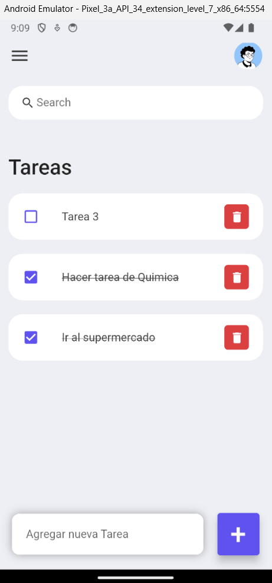
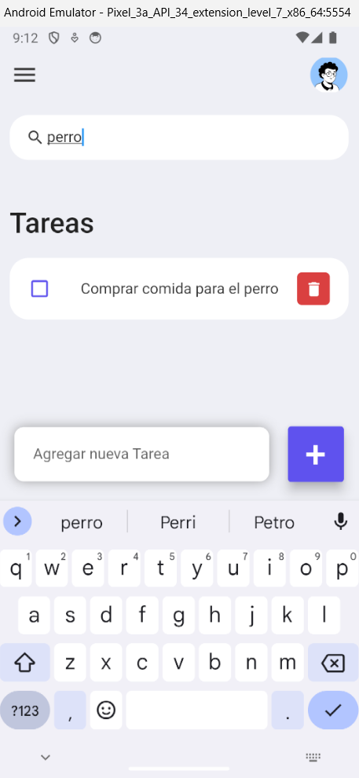

# first_app - App de Tareas

Esta aplicacion es un simple ejemplo de una ToDo App, donde podemos agregar nuestras tareas pendintes y hacer una lista con estas. Dentro el ejercicio vi como preparar un ambiente simple para desarrollar apps en el framework de Flutter y Dart.

Con este ejemplo me acerque a esta tecnologia y pude ver temas de organizacion de carpetas y buenas practicas para la creacion de componentes reutilizables o Widgets como se conoce en esta tecnologia. Tambien pude ver como manejar diferentes tipos de datos primitivos como los Strings, Int y Bools. Como la tambien la creacion de Objetos y Listas.

## Capturas de pantalla

